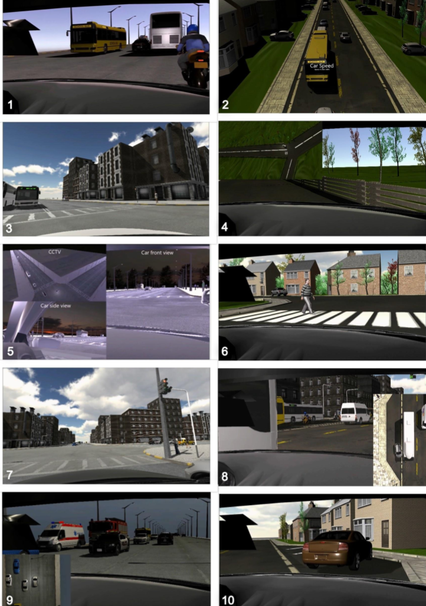

# Human Acceptance of Unpredictable Behaviors in Fully Driverless Ride-Hailing Services

**Background:**  
In 2018, Waymo launched a self-driving taxi service called "Waymo One" in Metro Phoenix area of Arizona. While the cars were capable enough on the roads, each of them had a human attendant. Two years later, the company has kicked off a fully-driverless taxi service in the same area, this time, open to public. Tesla announced its own fleet of Robotaxis to hit the market in the near future. Likewise, a slew of other AV companies have made the same claims.  

Based on Waymo One's feedback reviews, only 70% of customers were perfectly satisfied with their rides. Shakiness, excessive braking, weird drop-offs, etc. were among the many causes of dissatisfaction. Given that Robotaxis are unlikely to match human level of competence in their initial years, it is worth investigating how well they withstand the competition from human-driven services.  

**Objectives:**  
Modern life demands efficient use of time as a resource. It is a common instance that a person hailing a taxi is looking to get to their destination reasonably faster than, say, buses or other means of public transport. Under such time constraints, will people appreciate the slow merging onto highways or say, the bottlenecks caused by adhering strictly to speed limits? Will they be forgiving and accepting of wrong detection of roads or obstacles or numerous other possible mistakes?  

In this study, we seek to understand surveyor's attitudes towards Robotaxis when pitted against a similar performance by human-driven taxis. Given the flawed performance of a Robotaxi and an equally flawed performance by a human-driven taxi, we seek to understand which service a rider is inclined to take and  why.  

**Approach:**  
A total of 10 scenarios were created. The circumstance described in each video has been observed or reported by passengers of famous Level 4 and Level 5 company autonomous vehicles. These circumstances were replicated in Unity 3D by taking cues from such reports and Youtube videos. 40 participants were made into two groups.  

**Group 1:** This group was told that the taxi they were sitting in was self-driving. They were shown all the scenarios one by one and asked to rate the driving on several items.  

**Group 2:** This group was told that the taxi is driven by a human. They were shown the same scenarios as those of the first group and asked to rate the driving on the same items.  

The design and planning of the videos in the scenarios was made in Unity 3D, a cross-platform game engine that allows users to create 3D and 2D games.  

The scenario videos were shot from the point of view of the shotfun rider of the taxi. Of the 10 scenarios, 6 were faulty and 4 were fault-free. The fault-free scenarios served as a measure of critical judgement from participants when no error in driving is shown. This will inform us about the inherent biases against the taxi service.  

The scenarios designed are:  

1. Sudden braking
2. Slow driving
3. Smooth left turn
4. Over-correction
5. Red light turning
6. Pedestrian crossing
7. Obeying traffic lights
8. Rash merging
9. Smooth merging
10. Driving area misclassification

**Hypothesis:**  
Given identical situations, the Robotaxi has a higher favorability rating than that of a human-driven taxi.

**Results:**  
- The Robotaxi's performance on driving aspects such as Judgement, Comfort, Safety, Carefulness, Speed, Patience and Alertness was better than or similar to that of human-driven Taxi across all the scenarios.

- Greater blame was put on human-driven Taxi in faulty scenarios.
- In fault-free scenarios, human-driven taxis were rated badly on assumption of hypothetical errors.
- In Low-risk scenarios, Robotaxi was judged to be significantly more skilled than human-driven Taxi.
- In Low-risk scenarios, human-driven taxi was blamed more while no such trend was observed in High-Risk scenarios.
- 55% of the participants were willing to use the Robotaxi service in future, as opposed to 5% in case of human-driven Taxi.
- Overall, Robotaxi was rated significantly higher than human-driven Taxi.

**Final result:**  
Given identical circumstances, favorability ratings for Robotaxi (Mdn=3) were higher than those of human-driven Taxi (Mdn=3). A Mann-Whitney test indicated that this difference was statistically significant, p<0.05.

**Survey Link:** https://tarushree.github.io/hri.github.io  

